# 🏥 Healthcare Gender Analytics Platform

[](https://python.org)
[](https://pandas.pydata.org/)
[](https://huggingface.co/transformers/)
[](LICENSE)

> **Analyzing gender disparities in medical device payments to promote leadership development in women healthcare professionals**

## 🎯 Project Overview

The Healthcare Gender Analytics Platform is a comprehensive data analysis system designed to identify and analyze gender-based payment disparities in the medical device sector. Using 3 years of OpenPaymentsData (2021-2023), this platform provides actionable insights to promote gender equity in healthcare professional compensation.

### Key Objectives
- **Promote Leadership Development**: Focus on advancing women in healthcare leadership roles
- **Data-Driven Insights**: Quantify gender disparities across medical device companies
- **Strategic Recommendations**: Provide actionable strategies for reducing payment gaps

## 🏗️ System Architecture


## 🔄 Data Pipeline Architecture

```mermaid
flowchart TD
    A[📁 Raw CSV Files<br/>research_2021-2023.csv<br/>general_2021-2023.csv] --> B[🧹 Data Cleaning<br/>Remove duplicates<br/>Normalize company names]
    
    B --> C[🤖 Gender Classification<br/>ML Model: REA_GenderIdentification_v1<br/>Predict M/F from first names]
    
    C --> D[📊 Payment Analysis<br/>Calculate gender gaps<br/>Aggregate by company & year]
    
    D --> E[📈 Trend Analysis<br/>Year-over-year changes<br/>Specialty comparisons]
    
    E --> F[📋 Reports & Visualizations<br/>Executive summaries<br/>Interactive charts<br/>Strategic recommendations]
    
    style A fill:#e3f2fd
    style C fill:#f3e5f5
    style E fill:#e8f5e8
    style F fill:#fff3e0
```



## 💻 Technology Stack


## 📊 Key Findings Summary

### Overall Payment Disparities
- **60% higher spending** on male healthcare professional promotions
- **Consistent male dominance** across top-20 medical device companies
- **$670M total payments** in 2023 with 80.6% to males, 13.2% to females

### Positive Trends
- **Education spending gap** improving: 9.6% improvement over 3 years
- **Speaker payments** showing faster progress: 20% improvement
- **Research gender gap** decreased by 51% ($5.5M to $2.7M)
- **Female non-physician practitioners** saw 300% rise in research funding

### Areas of Concern
- **Consulting fees gap** widening consistently
- **Debt forgiveness disparities** persist across all years
- **Medical doctor payments** heavily skewed toward males


### 1. Data Processing
```python
from src.data_processing import DataCleaner, CompanyNormalizer

# Initialize data processor
cleaner = DataCleaner()
normalizer = CompanyNormalizer()

# Process raw data
cleaned_data = cleaner.process_payments_data('data/raw/research_2023.csv')
normalized_data = normalizer.standardize_company_names(cleaned_data)
```

### 2. Gender Classification
```python
from src.gender_classification import GenderPredictor

# Initialize gender classification model
gender_predictor = GenderPredictor(model_path="malcolm/REA_GenderIdentification_v1")

# Predict gender from names
predictions = gender_predictor.predict_batch(first_names_list)
```

### 3. Analytics
```python
from src.analysis import PaymentAnalyzer, TrendAnalyzer

# Analyze payment gaps
analyzer = PaymentAnalyzer()
gap_analysis = analyzer.calculate_gender_gaps(processed_data)

# Generate trend analysis
trend_analyzer = TrendAnalyzer()
trends = trend_analyzer.analyze_temporal_trends(gap_analysis)
```

### 4. Visualization
```python
from src.visualization import DashboardGenerator

# Generate interactive dashboard
dashboard = DashboardGenerator()
dashboard.create_payment_analysis_dashboard(trends_data)
```

## 📈 Data Flow Process


## 🎯 Key Features

### Core Analytics
- **Payment Gap Analysis**: Comprehensive gender disparity calculations
- **Temporal Trend Analysis**: Multi-year progression tracking
- **Company Benchmarking**: Cross-organizational comparisons
- **Specialty-Based Insights**: Analysis by medical professional type

### Advanced Capabilities
- **ML-Powered Gender Classification**: Automated gender identification from names
- **Dynamic Company Normalization**: Intelligent company name standardization
- **Interactive Visualizations**: Real-time data exploration
- **Automated Report Generation**: Executive and technical reporting

### Data Quality Assurance
- **Missing Data Imputation**: Intelligent handling of incomplete records
- **Outlier Detection**: Statistical anomaly identification
- **Data Validation**: Comprehensive quality checks
- **Cross-Reference Validation**: Multi-source data verification


## 🔍 Supported Analysis Types

1. **Temporal Analysis**
   - Year-over-year payment trends
   - Quarterly progression analysis
   - Seasonal pattern identification

2. **Categorical Analysis**
   - Payment type breakdowns
   - Professional specialty comparisons
   - Company-specific analysis

3. **Comparative Analysis**
   - Gender ratio calculations
   - Cross-company benchmarking
   - Industry trend comparison

4. **Predictive Insights**
   - Trend projection modeling
   - Gap closure timeline estimation
   - Intervention impact simulation

## 🎯 Actionable Recommendations

Based on our analysis, the platform generates specific recommendations:

### Immediate Actions
- **Targeted Leadership Workshops** for specialties with 52% male dominance
- **Increased Research Opportunities** to address 43% research gap for female physicians
- **Structured Mentorship Programs** pairing female professionals with industry leaders

### Strategic Partnerships
- **Company Collaboration** with leading organizations for best practice sharing
- **Policy Development** for more equitable compensation frameworks
- **Industry Benchmarking** for continuous improvement tracking

## 🧪 Testing

```bash
# Run unit tests
python -m pytest tests/

# Run specific test modules
python -m pytest tests/test_data_processing.py
python -m pytest tests/test_gender_classification.py

# Generate coverage report
python -m pytest --cov=src tests/
```

## 📋 Configuration

The platform uses YAML configuration for flexible deployment:

```yaml
# config/settings.yaml
data:
  source_path: "data/raw/"
  output_path: "data/processed/"
  companies:
    - "Medtronic, Inc."
    - "Johnson & Johnson"
    - "Abbott Laboratories"
    # ... additional companies

ml_models:
  gender_classification:
    model_path: "malcolm/REA_GenderIdentification_v1"
    batch_size: 32
    confidence_threshold: 0.8

analysis:
  years: [2021, 2022, 2023]
  payment_types: ["research", "general"]
  currencies: ["USD"]
```

## 📄 License

This project is licensed under the MIT License - see the [LICENSE](LICENSE) file for details.

## 🙏 Acknowledgments

- **Team Husky Trailblazers**: Malak Parmar, Chaitrali Patne, Yash Sodvadiya, Shreyansh Agarwal, Yixuan Liu, Yunjie Xiong
- **Course**: INT 6940 Experiential Network Projects
- **Professor**: Yin Jiang
- **Project Sponsor: Dooit - Mariana Ferrari
- **Institution**: Northeastern University College of Professional Studies
- **Data Source**: CMS OpenPayments Database
- **ML Model**: REA Gender Identification Model by Malcolm
